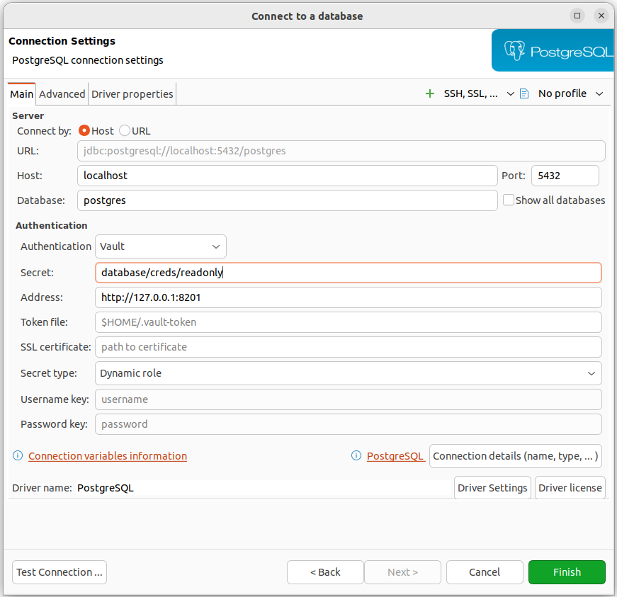

# DBeaver Vault plugin

Provides database credentials using [Vault dynamic secrets](https://www.vaultproject.io/docs/secrets/databases).

Vault login is not handled by this plugin.

You should manually log in into Vault, which will, using the default [Token Helper](https://www.vaultproject.io/docs/commands/token-helper), create a Vault token file in `$HOME/.vault-token`. Check another [Vault Token Helper](https://github.com/joemiller/vault-token-helper) with support for native secret storage on macOS, Linux, and Windows.

This plugin will cache credentials in memory until it expires.

## Installation With Update Site URL

 * Click Help → Install New Software... then enter this url:
 
    `https://raw.githubusercontent.com/premium-minds/dbeaver-vault/master/update-site/`
 * Make sure _DBeaver Vault_ is checked, then click Next to install the plugin.
 * See [Optional extensions](https://github.com/dbeaver/dbeaver/wiki/Optional-extensions) if you have any problems installing the plugin

## Install from Marketplace

 * [DBeaver Vault](https://marketplace.eclipse.org/content/dbeaver-vault)

## Screenshots

## Configuration

Use the following settings to connect DBeaver to HashiCorp Vault and retrieve credentials:

* **Secret** *(Required)*
  The API path to the secret in Vault.
* **Address** *(Optional)*
  The Vault server URL.
  If not specified, the plugin will use the `VAULT_AGENT_ADDR` environment variable, and then `VAULT_ADDR` as a fallback.
* **Token File** *(Optional)*
  Path to the Vault token file.
  If not provided, the plugin will fall back to the Vault Token Helper, and then `$HOME/.vault-token`.
* **SSL Certificate** *(Optional)*
  Path to the SSL certificate to trust.
  Defaults to the value of the `VAULT_CACERT` environment variable if not set.
* **Namespace** *(Optional)*
  Absolute or relative namespace path.
  Defaults to the value of the `VAULT_NAMESPACE` environment variable if not set.
* **Secret Type** *(Required)*
  The type of secret to retrieve. Supported values:
  * Dynamic role
  * Static role
  * KV version 1
  * KV version 2
* **Username Key** *(Required for KV v1 and KV v2)*
  The JSON key used to extract the database username from the secret.
* **Password Key** *(Required for KV v1 and KV v2)*
  The JSON key used to extract the database password from the secret.

## Limitations

Support for parsing Vault config file from environment variable `VAULT_CONFIG_PATH` or default `~/.vault` is restricted to [JSON syntax](https://github.com/hashicorp/hcl/blob/main/json/spec.md) only. It does not support [native HCL syntax](https://github.com/hashicorp/hcl/blob/main/hclsyntax/spec.md). 

DBeaver has a [bug](https://github.com/dbeaver/dbeaver/issues/5317) that requires to re-install plugins after an upgrade.
