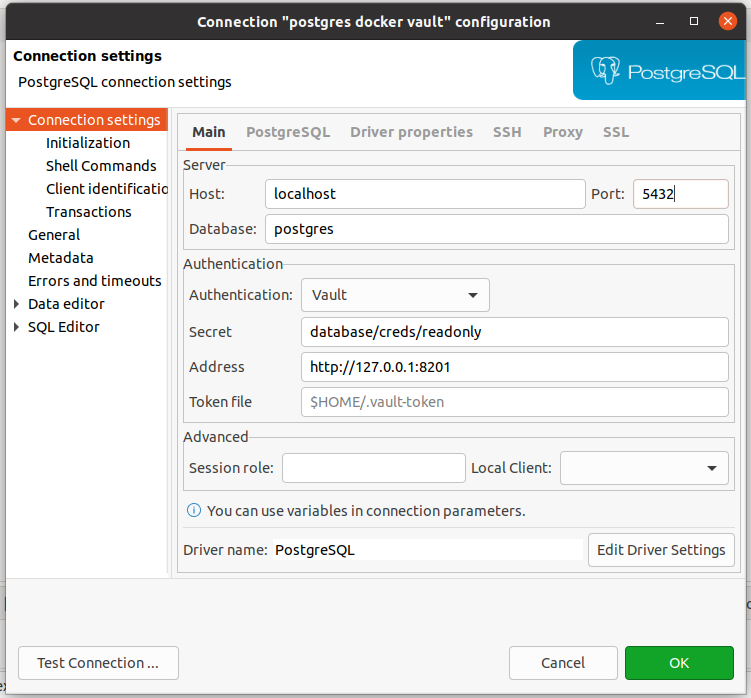

# DBeaver Vault plugin

Provides database credentials using [Vault dynamic secrets](https://www.vaultproject.io/docs/secrets/databases).

Vault login is not handled by this plugin.

You should manually log in into Vault, which will, using the default [Token Helper](https://www.vaultproject.io/docs/commands/token-helper), create a Vault token file in `$HOME/.vault-token`.

The recommended way to use this plugin is with a [Vault Agent](https://www.vaultproject.io/docs/agent), with [Auto-Auth](https://www.vaultproject.io/docs/agent/autoauth) and [cache](https://www.vaultproject.io/docs/agent/caching) enabled.

## Installation With Update Site URL

 * Click Help → Install New Software... then enter this url:
 
    `https://raw.githubusercontent.com/premium-minds/dbeaver-vault/master/update-site/`
 * Make sure _DBeaver Vault_ is checked, then click Next to install the plugin.

## Screenshots

